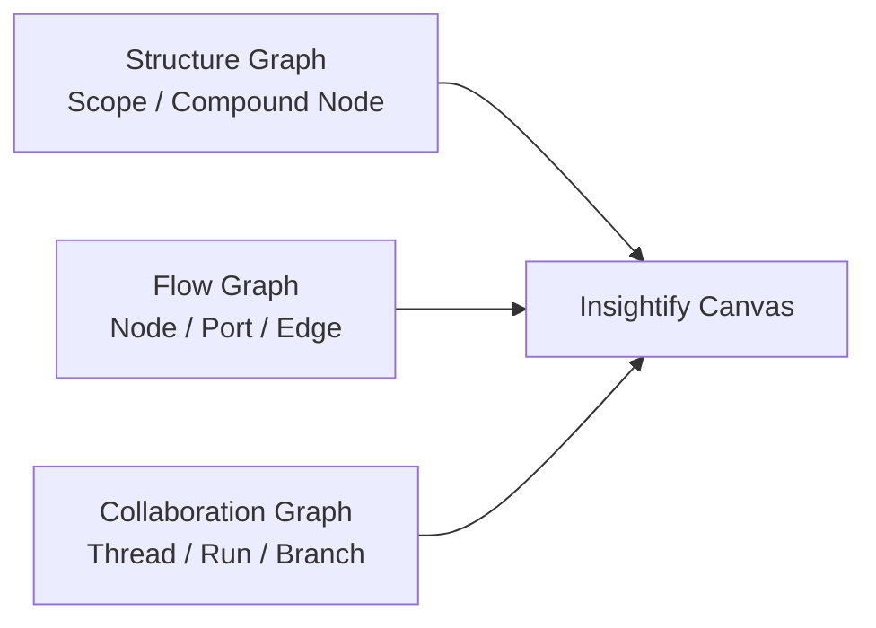
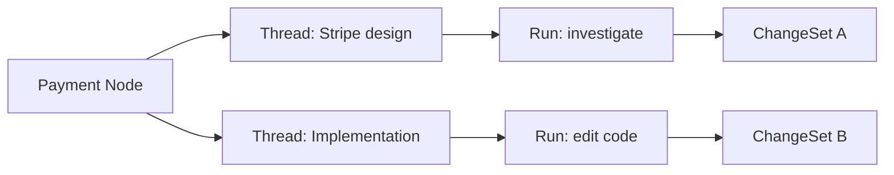
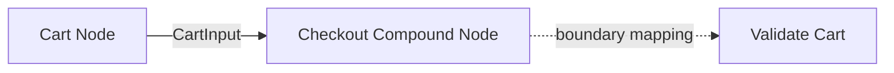
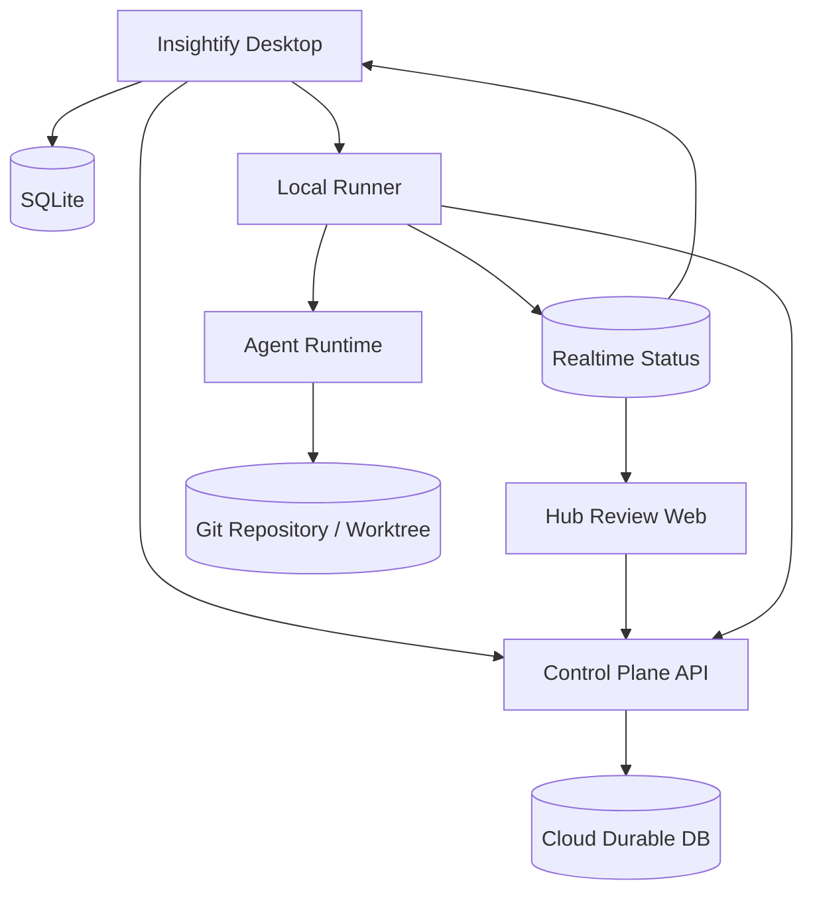
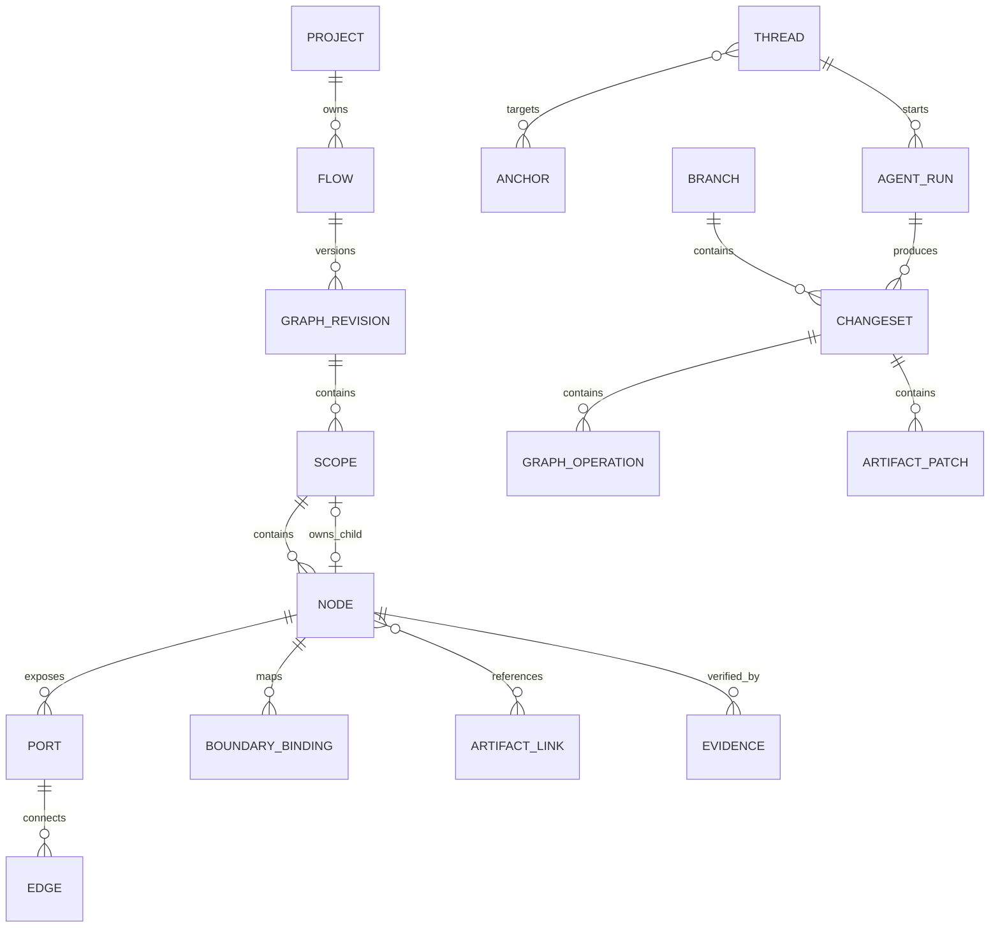

# Insightify — Recursive Flow-Based AI Development Environment

**Status:** Draft  
**Product name:** Insightify  
**Core interaction model:** FlowFold  
**Last updated:** 2026-08-24

Insightify は、ソフトウェアを抽象から具体へ辿れる再帰的なフローとして設計し、フロー上の任意の場所で
人間と AI が共同作業するための開発環境である。

従来の AI 開発環境は、ターミナルまたはチャットの 1 本の時系列に、設計、実装、調査、テスト、レビューを
混在させる。Insightify は、会話と Agent の作業をソフトウェア構造上の場所へ結び付け、設計、変更、検証の
関係を空間的かつ追跡可能にする。

FlowFold は Insightify の中核 UI・構造モデルである。複雑なフローを Compound Node の中へ畳み、必要な
Scope だけへ入って詳細を扱う。子孫の実寸を祖先レイアウトへ伝播させず、一般的なフローチャートで発生する
過大な余白と全体再配置を避ける。

本書の命名決定は新しいプロダクト設計上の語彙を定めるものであり、現行 repository、package、proto namespace
に残る `Synthify` を直ちに一括 rename する指示ではない。rename の対象、互換性、移行順序は実装開始前に
別途 migration plan で決定する。

---

## 0. Executive Summary

Insightify の設計上の中心は、次の 3 種類のグラフを分離して保持し、一つの UI 上で投影することである。

1. **Structure Graph** — 抽象から具体への Scope 階層
2. **Flow Graph** — 制御、データ、依存関係
3. **Collaboration Graph** — Thread、Agent Run、Branch、ChangeSet の分岐と結合



各概念は次の責務を持つ。

| Concept | Responsibility |
|---|---|
| Project | リポジトリと複数の Flow を束ねる開発単位 |
| Flow | ユーザーが扱うソフトウェアフロー |
| Scope | 独立したローカル座標系を持つグラフ空間 |
| Node | 仕様・実装責任・作業状態を持つ単位 |
| Compound Node | 子 Scope を所有する Node |
| Port | Node の外部契約となる入出力境界 |
| Edge | Port 間の制御、データ、依存関係 |
| Room | ユーザーが Scope に入ったときの UI 上の作業空間 |
| Thread | 人間と AI の継続的な対話と意思決定 |
| Agent Run | AI がツールを使用して行う一回の実行 |
| Branch | 同一 Revision から分岐した変更系列 |
| ChangeSet | Graph と Artifact に対する原子的な変更提案 |
| Artifact | ソースコード、テスト、API、DB、文書などの成果物 |

Node、Thread、Agent Run を同一視しない。Node は永続する設計・作業単位であり、一つの Node に複数の
Thread と Agent Run が存在できる。

---

## 1. Problem Statement

### 1.1 従来のフローチャートの問題

- 詳細を一枚へ展開すると、ノード間の余白と長い Edge が増える。
- 深い構造を Group Node として展開すると、子孫サイズが祖先へ伝播し、キャンバス全体が再配置される。
- 抽象的なシステム構造と具体的な処理手順を同じ縮尺で表現しようとするため、どちらも読みにくくなる。
- 図がコードやテストから独立し、実装後に古くなる。
- Flow、階層、タスク管理、会話を同じ Node/Edge で表すと意味が曖昧になる。

### 1.2 従来の AI 開発環境の問題

- 一つの長い会話に複数の論点が混ざる。
- ユーザーが毎回、対象ファイル、関連仕様、過去の決定を説明する必要がある。
- 複数の Agent を並列に動かすと、作業範囲と競合が見えにくい。
- AI の「完了」が、コード差分、テスト結果、仕様変更と結び付いていない。
- Session の fork、merge、停止、再開、引き継ぎがチャット履歴に依存する。

### 1.3 Insightify が解く問題

Insightify は、ユーザーが「ソフトウェアのどこについて考え、どこを変更しているか」を主コンテキストにする。
AI は現在位置、選択範囲、接続関係、Artifact、Revision から必要な文脈を構築し、自由文の返答だけでなく
検証可能な ChangeSet を返す。

---

## 2. Goals and Non-Goals

### 2.1 Goals

- ソフトウェアを抽象から具体へ再帰的に分解できる。
- 深い子孫を持つ Flow でも、親 Scope のレイアウトを安定させる。
- Node、Port、Edge、選択範囲を起点に AI と対話できる。
- AI が Graph とコードへ行う変更を、一つの ChangeSet として preview、apply、undo できる。
- 複数の Thread、Agent Run、Branch を同時に保持し、成果物単位で比較・結合できる。
- Node の完了状態を、テスト、契約、Revision などの証拠と結び付ける。
- 人間が AI の作業範囲、権限、進捗、競合を理解できる。
- Graph と実装の不一致を検出し、どちらを更新するか選択できる。

### 2.2 Initial Non-Goals

- 任意のプログラムを Flow Graph だけから完全生成すること。
- 既存コードベース全体を AST から完全な Flow へ自動変換すること。
- Flow Graph 自体を汎用プログラミング言語として実行すること。
- 初期リリースから無制限の自律 Agent 群を動かすこと。
- AI の提案を承認なしに本流へ自動 merge すること。
- すべての会話ログを恒久的なプロジェクト知識として扱うこと。
- Flow UI に IDE の全機能を再実装すること。

Flow Graph の実行可能性は将来拡張である。v1 では Graph を「設計と作業の正本」、コードを「実装の正本」
として扱い、両者の関係を Artifact Link と Drift 検出で管理する。

---

## 3. Design Principles

### 3.1 Location is Context

ユーザーがいる Scope、選択した Node/Edge、開いている Thread が AI の主コンテキストになる。プロンプトへ
毎回すべてを説明させない。

### 3.2 Contracts at Boundaries

Node の内部実装より先に、Port と Edge の契約を明示する。階層をまたぐ接続は Compound Node の境界 Port を
必ず通す。

### 3.3 Proposal Before Mutation

AI はまず ChangeSet を提案する。正本の更新は preview と検証を経て apply する。単なるチャット回答と
mutation capability を構造的に分離する。

### 3.4 Evidence Before Done

Node は、AI が完了を宣言しただけでは Done にならない。Acceptance 条件、テスト結果、Artifact 状態、
Revision の一致を証拠として持つ。

### 3.5 Local Layout, Stable Parent

各 Scope は独立した座標系とレイアウトを持つ。子 Scope の Node 数、Edge 数、実寸は親 Node のレイアウト
需要へ伝播させない。

### 3.6 Conversation is not Source of Truth

会話ログから、Decision、Assumption、Open Question、Rejected Option、Artifact Link を構造化して保存する。
設計判断を再現するために全会話の再読を要求しない。

### 3.7 Explicit Ownership

Project、Graph Revision、Agent Run、Artifact Change、live status の正本を明示する。UI 表示用の通知状態を
永続データの正本にしない。

---

## 4. The Three Graphs

### 4.1 Structure Graph

Structure Graph は Scope の包含関係を表す。包含関係は循環しない rooted tree とする。

```text
Project Root Scope
├─ Authentication Node → Authentication Scope
│  ├─ Validate Token
│  └─ Load User
└─ Checkout Node → Checkout Scope
   ├─ Validate Cart
   ├─ Authorize Payment
   └─ Create Order
```

Node は最大一つの子 Scope を所有できる。子 Scope を持つ Node を Compound Node と呼ぶ。同一 Node を複数の
親 Scope へ直接配置せず、再利用は Reference Node または Artifact Link で表す。

### 4.2 Flow Graph

Flow Graph は各 Scope 内の Port 間 Edge である。DAG に限定せず、分岐、合流、loop を許可する。

Edge は少なくとも次の種別を持つ。

| Edge kind | Meaning |
|---|---|
| control | 処理順序、条件分岐、状態遷移 |
| data | 型を持つ値またはイベントの伝播 |
| dependency | 実装、デプロイ、作業上の依存 |
| error | 失敗、例外、補償処理への遷移 |
| reference | 非実行の関連参照 |

異なる kind を同じ線の装飾だけで曖昧に表現しない。表示フィルターで Edge kind を切り替えられるようにする。

### 4.3 Collaboration Graph

Collaboration Graph は、どの場所で誰が何を検討・変更したかを表す。



Collaboration Graph は Flow Graph の一部ではない。Thread や Agent Run を Flow Node として表示しない。
Canvas 上では badge、overlay、side panel、activity layer として投影する。

---

## 5. FlowFold Model

### 5.1 Compound Node as Portal

Compound Node は子 Node を内側に並べた可変サイズ container ではなく、子 Scope への Portal である。

Collapsed 表示では以下だけを表示する。

- title と短い purpose
- external Ports
- status と evidence summary
- active Thread / Agent Run 数
- child Scope の要約

ユーザーが Node へ enter すると、子 Scope が主 viewport になる。親 Scope は breadcrumb と minimap に残る。

### 5.2 Boundary Port Mapping

階層をまたぐ Edge は Compound Node の外部 Port と、子 Scope 内の Port の mapping で表現する。



概念モデル:

```text
BoundaryBinding
├ compound_node_id
├ external_port_id
├ internal_node_id
└ internal_port_id
```

直接の cross-scope Edge は保存時に拒否する。この制約により、Scope を閉じた状態でも外部契約が完全に残る。

### 5.3 Layout Invariants

FlowFold layout は次を不変条件とする。

1. Scope ごとに座標系を分離する。
2. Compound Node の親 Scope 上のサイズは、子 Scope の実寸から計算しない。
3. 子 Scope の自動配置は親 Scope の Node 位置を変更しない。
4. Node を enter/leave しても、各 Scope の manual placement を保持する。
5. 非表示の子孫 DOM を常時 mount しない。
6. Edge routing は Scope 内で完結し、階層境界では Port へ集約する。
7. LOD の変更で Graph の意味と selection を失わない。

### 5.4 Semantic Zoom

Node は画面上の投影サイズに応じて情報量を変える。

| Level | Display |
|---|---|
| L0 | title、status、主要 Ports |
| L1 | purpose、child count、evidence summary |
| L2 | input/output、active Thread、Artifact summary |
| L3 | Node inspector または子 Scope の preview |

文字を単純に縮小して情報を詰め込まない。重要度の低い field を段階的に省略する。

### 5.5 Focus, Peek, and Split View

- **Select:** Node/Edge を inspector の対象にする。
- **Peek:** 子 Scope を一時的な overlay で確認する。
- **Enter:** 子 Scope を主 Room として開く。
- **Pin:** Scope または inspector を side tray へ固定する。
- **Split:** 二つの Scope を左右に表示し、境界契約を比較する。
- **Leave:** breadcrumb または Esc で親 Scope へ戻る。

複数階層を同時に全面展開する操作は primary path にしない。全体理解には breadcrumb、minimap、search、
reference link を使用する。

### 5.6 Relation to Existing paper-in-paper

既存 paper-in-paper から再利用可能な概念:

- pure reducer と Command による状態遷移
- Paper/Node ID による O(1) lookup
- focus、open、pin、attention の操作モデル
- iframe bridge と structured content
- manual placement と drag/reparent

FlowFold で変更する点:

- 子孫需要を祖先の矩形配分へ再帰的に伝播させない。
- 全 Scope の Node を同時に表示せず、active/pinned Scope のみ描画する。
- content と children の一枚の room 分割ではなく、Node inspector と child Scope navigation を分離する。
- AI Thread を child Node として常設しない。
- Flow Port、typed Edge、Boundary Binding を first-class model にする。

---

## 6. Node and Edge Contracts

### 6.1 Node Contract

Node は最低限、次の構造化された contract を持つ。

```yaml
purpose: 決済を承認する
inputs:
  - name: request
    schema: PaymentRequest
outputs:
  - name: payment
    schema: PaymentResult
errors:
  - card_declined
  - provider_timeout
preconditions:
  - cart is validated
invariants:
  - never charge the same idempotency key twice
acceptance:
  - timeout retries at most three times
  - duplicate requests return the original result
```

Contract の自由文と構造化 field を併用する。すべてを初期入力で必須にせず、AI が不足を検出して提案できる。

### 6.2 Port Contract

Port は以下を持つ。

- direction: input / output
- semantic kind: control / data / error
- schema または event type
- required / optional
- cardinality
- description
- compatibility status

### 6.3 Edge Contract

Edge は接続だけでなく、境界上の保証を持てる。

```yaml
kind: data
schema: PaymentRequest
delivery: at_least_once
timeout_ms: 5000
on_error: payment-timeout
```

Node 内部の実装が正しくても、Edge contract が一致しなければ Flow は complete ではない。

### 6.4 Artifact Links

Node とコードを一対一に固定しない。Artifact Link は多対多とする。

```text
ArtifactLink
├ anchor_id: Node / Port / Edge / Scope
├ artifact_kind: file / symbol / test / api / database / document
├ locator
├ relation: implements / verifies / documents / configures / observes
└ last_verified_revision
```

file path だけでなく symbol、line range、API operation、DB entity を locator として扱える拡張余地を持つ。

---

## 7. Interaction Modes

同一データを目的別に投影する。

### 7.1 Design Mode

- Node、Port、Edge、Scope を編集する。
- Contract と Acceptance 条件を定義する。
- AI の Graph ChangeSet を preview/apply する。
- 抽象度を移動しながらシステムを理解する。

### 7.2 Build Mode

- Thread、Agent Run、lease、ChangeSet を表示する。
- 実装担当、変更ファイル、テスト進捗、conflict を確認する。
- Branch を比較し、本流へ fold する。

### 7.3 Run Mode

- テストまたは実行 trace を Flow 上へ投影する。
- 通過した Edge、失敗 Node、latency、retry を確認する。
- 失敗地点から Thread を開始する。

v1 は Design と Build を対象とする。Run Mode の本格的な runtime telemetry mapping は後続 phase とする。

---

## 8. Anchored AI Collaboration

### 8.1 Anchor

Thread は一つ以上の Anchor を持つ。

```text
Anchor
├ project_id
├ graph_revision_id
├ scope_id?
├ node_id?
├ port_id?
├ edge_id?
├ artifact_locator?
├ selected_node_ids[]
└ selected_text?
```

単一 Node、Edge、複数選択、コード範囲、Scope 全体を同じ仕組みで扱う。Anchor が stale になった場合は、
自動で別の対象へ黙って付け替えず、復元結果または fallback を表示する。

### 8.2 Contextual Composer

Node header、Edge、selection toolbar、global canvas から同じ composer を起動する。ユーザーは Ask、Edit、
Implement などの intent を先に選ばなくてもよい。

LLM は次の intent を構造化して返す。

| Intent | Meaning |
|---|---|
| answer | 説明または質問への回答 |
| search | Graph、Artifact、履歴の検索 |
| propose_graph_change | Node/Port/Edge/Scope 変更の提案 |
| propose_artifact_change | コードまたは文書変更の提案 |
| create_thread | 論点を独立 Thread として分離 |
| start_agent_run | tool 使用を伴う作業の開始候補 |
| request_decision | 曖昧または高影響な選択肢の提示 |

mutation intent は直接適用せず、必ず ChangeSet preview へ進む。

### 8.3 Structured Thread Memory

Thread は raw message history に加えて次を保持する。

```text
ThreadMemory
├ decisions
├ assumptions
├ open_questions
├ rejected_options
├ referenced_anchors
├ related_artifacts
└ last_summarized_message_id
```

Decision の変更は上書きではなく supersedes relation を持つ。過去の判断と変更理由を追跡できるようにする。

### 8.4 Context Compiler

Context Compiler は Agent/LLM へ渡す入力を、Anchor と Graph から構築する。

優先順位の初期値:

| Priority | Context |
|---:|---|
| 100 | 選択中 Anchor と Node Contract |
| 90 | 対象 Port/Edge Contract |
| 80 | 直接接続された Node |
| 70 | 祖先 Scope の purpose と boundary |
| 60 | user-pinned Node/Artifact |
| 50 | ThreadMemory と直近 messages |
| 30 | 類似 Node、reference Edge |
| 10 | Project 全体 summary |

Context Compiler は入力候補、採用理由、token/character budget、Graph Revision を snapshot として保存する。
これにより回答と実行の再現性を高める。

### 8.5 Context Isolation

別 Thread の raw history を暗黙に混ぜない。共有するのは explicit reference または構造化された Decision と
Handoff のみとする。複数 Agent 間の情報漏れと、古い判断の混入を避ける。

---

## 9. ChangeSet and Revision Model

### 9.1 Graph Revision

Graph の正本は immutable Revision と operation log で管理する。

```text
GraphRevision
├ revision_id
├ project_id
├ parent_revision_ids[]
├ created_by
├ created_at
└ summary
```

通常変更は一つの parent、Branch merge は複数 parent を持てる。

### 9.2 ChangeSet

ChangeSet は Graph 変更と Artifact 変更を一つのレビュー単位にまとめる。

```text
ChangeSet
├ changeset_id
├ base_revision_id
├ branch_id
├ graph_operations[]
├ artifact_patches[]
├ affected_anchors[]
├ validations[]
├ evidence[]
├ created_by
└ status
```

status:

```text
draft → proposed → approved → applying → applied
                  ├→ rejected
                  ├→ conflict
                  └→ failed
```

### 9.3 Graph Operations

初期 operation set:

- create/update/delete Node
- create/update/delete Port
- connect/disconnect Edge
- create/delete Scope
- bind/unbind Boundary Port
- move Node within Scope
- move Node across Scope
- attach/detach Artifact
- update Contract
- update Acceptance condition

Operation は stable ID を対象にし、表示上の index や title を identity に使わない。

### 9.4 Preview

Preview は以下を同時に表示する。

- 追加 Node/Edge: 半透明または緑の ghost
- 削除 Node/Edge: 赤い点線
- Contract: field-level diff
- Artifact: unified diff
- Validation: pass/fail/warning
- 影響 Scope、Node、Artifact

Graph とコードのどちらか一方だけを apply して不整合になる場合、部分 apply を既定で許可しない。

### 9.5 Undo

Undo は UI state の巻き戻しではなく、applied ChangeSet に対する inverse ChangeSet として記録する。監査履歴を
消さずに正本を戻す。

---

## 10. Thread, Agent Run, Branch, and Merge

### 10.1 Thread

Thread は対話と意思決定の単位であり、tool 実行権限を必ずしも持たない。read-only Thread と mutation-capable
Agent Run を service 境界で分離する。

### 10.2 Agent Run

Agent Run は一回の有限な作業である。

```text
queued
  ↓
preparing
  ↓
running
  ├→ awaiting_approval
  ├→ blocked
  ├→ cancelled
  ├→ failed
  └→ verifying → succeeded
```

Run は objective、base Revision、context snapshot、read/write set、tool policy、budget、Handoff を持つ。

### 10.3 Branch

Branch は一つ以上の ChangeSet を保持する変更系列である。同じ Node に対する代替案を別 Branch として保持できる。

Branch fork は以下を snapshot する。

- base Graph Revision
- base Git commit
- active Node/Scope
- relevant ThreadMemory
- Artifact mapping

### 10.4 Handoff

Run 終了時は raw transcript ではなく構造化された Handoff を生成する。

```yaml
result: succeeded
objective: Implement payment retry
changed_nodes:
  - payment-authorize
changed_artifacts:
  - apps/api/payment.ts
tests:
  - name: payment retry
    result: passed
decisions:
  - retry only after status lookup
open_questions:
  - webhook integration test is not implemented
base_revision: rev_42
```

### 10.5 Merge

Session の結合は transcript の連結ではない。Graph operations、Artifact patch、Decision、Evidence を merge する。

Merge pipeline:

1. base Revision と target Revision の比較
2. Graph operation conflict の検出
3. Artifact three-way merge
4. Contract と Acceptance の再検証
5. affected tests の実行
6. Decision と Open Question の統合 preview
7. 新しい Graph Revision の作成

代替案 Branch は、採用されなくても Rejected Option として ThreadMemory へ要約できる。

---

## 11. Concurrency and Locking

### 11.1 Read, Propose, Apply

競合制御を三段階に分ける。

- **Read:** lock 不要
- **Propose:** 同一対象に複数の ChangeSet を作成可能
- **Apply:** revision 検査と短期間の write lease が必要

### 11.2 Read/Write Set

Agent Run は開始前または planning 完了時に作業範囲を宣言する。

```yaml
read_set:
  nodes: [checkout, order-api]
  artifacts: [order.ts]
write_set:
  nodes: [payment]
  artifacts: [payment.ts, payment.test.ts]
base_graph_revision: rev_42
base_git_commit: abc123
```

write set が重なる Run は、同時実行を禁止するのではなく conflict risk を表示する。自動 schedule 方針は
Project policy で選択できる。

### 11.3 Lease

Apply の lease は以下を持つ。

```text
WriteLease
├ target kind/id
├ owner Run
├ acquired_at
├ expires_at
└ heartbeat_at
```

Agent が停止しても永久 lock が残らないよう期限と heartbeat を必須にする。lease 期限切れ後も、ChangeSet は
失わず再検証可能な proposal として残す。

### 11.4 Optimistic Validation

Apply 時に次を検証する。

- base Graph Revision が現在 Revision の祖先か
- 対象 entity の version が変わっていないか
- Artifact の base blob/commit が一致するか
- 必要な lease を保持しているか
- Project policy 上の approval が揃っているか

不一致時は自動上書きせず、rebase、compare、keep as branch を提示する。

---

## 12. Node Lifecycle and Evidence

Node lifecycle:

```text
draft
  ↓
specified
  ↓
ready
  ↓
working
  ↓
review
  ↓
verifying
  ├→ failed
  ├→ conflict
  ├→ blocked
  └→ done
```

Node status は手動 annotation と機械判定を分離する。

Done policy の例:

- required Contract field が埋まっている。
- required Port が未接続ではない。
- Acceptance condition ごとに evidence がある。
- linked tests が最新 Artifact Revision で成功している。
- unresolved blocking Thread がない。
- applied ChangeSet と Graph Revision が一致している。

Evidence:

```text
Evidence
├ kind: test / review / runtime / manual / artifact
├ target: Node / Port / Edge / Acceptance
├ source locator
├ result
├ observed_at
└ artifact_revision
```

古い Revision に対するテスト成功は stale と表示し、現在の Done 判定へ暗黙に使用しない。

---

## 13. Code and Repository Integration

### 13.1 Local Runner

ユーザーのローカル repository を編集する場合、Desktop の sandboxed UI、privileged local runtime、
Synthify Hub control plane を分離する。具体的な process と技術選定は
[Technology Stack and Runtime Architecture](technology-stack.md) に定義する。



Hub control plane は共有済み Graph、Thread、Run metadata、ChangeSet を所有する。Desktop は local working state、
file tool、terminal、test、Git worktree を所有する。

### 13.2 Worktree Strategy

mutation-capable Branch ごとに独立 worktree を使用する。read-only Run は共有 checkout を利用できるが、
書き込み Run は本流 working tree を直接変更しないことを既定とする。

```text
Project repository
├ main working tree
├ worktree/run-a
├ worktree/run-b
└ worktree/run-c
```

Run 終了時に commit を必須にはしないが、Artifact patch の base commit/blob を必ず記録する。

### 13.3 Tool Policy

Agent Run は明示的な capability policy を持つ。

- read files
- edit files
- run tests
- execute arbitrary commands
- network access
- manage dependencies
- create commits
- access secrets

Node の位置だけで権限を暗黙に広げない。Project policy とユーザー approval を上限とする。

### 13.4 Drift Detection

Graph と code の完全な双方向同期ではなく、まず不一致を検出する。

検出例:

- code に存在する分岐が Flow にない。
- Port schema と API schema が一致しない。
- Acceptance condition を検証する test link がない。
- linked symbol が rename/delete されている。
- Artifact が last verified commit から変更されている。

Drift は自動修正せず、Graph 更新、code 更新、link 更新、ignore の proposal を提示する。

---

## 14. Conceptual Data Model

初期 schema は次の entity を独立して持つ。



Graph Revision ごとに全 entity を複製する必要はない。immutable operation log と materialized current view の
併用を想定する。具体的な SQL schema は別文書で決定する。

### 14.1 Source of Truth

| Data | Source of truth |
|---|---|
| Local Project / working Graph | Desktop SQLite materialized state |
| Shared Project / accepted Graph | Hub durable DB materialized state |
| Revision / ChangeSet / operations | local operation log; shared items are synchronized to Hub durable DB |
| Thread / message / ThreadMemory | SQLite locally; Hub durable DB when shared |
| Agent Run durable state / Handoff | SQLite locally; shared milestones in Hub durable DB |
| live token/progress/activity | realtime notification store |
| source code / test files | Git repository/worktree |
| UI viewport / selection / open inspector | client state, optionally user preference |

Realtime notification store は表示用 mirror であり、Run/ChangeSet の正本にしない。

---

## 15. API Boundaries

概念的な service 分割:

### GraphService

- GetFlow
- GetScope
- ProposeGraphChange
- ValidateChangeSet
- ApplyChangeSet
- ListRevisions
- RevertChangeSet

### CollaborationService

- CreateThread
- PostMessage
- GetThread
- UpdateThreadMemory
- AttachAnchor
- ResolveDecision

### AgentService

- PlanRun
- StartRun
- CancelRun
- GetRun
- ApproveRunAction
- GetRunHandoff

### BranchService

- CreateBranch
- CompareBranches
- RebaseChangeSet
- MergeBranch

### ArtifactService

- LinkArtifact
- ResolveArtifact
- DetectDrift
- GetArtifactDiff

read-only conversation service に mutation repository や runner capability を注入しない。Agent Run 起動と
ChangeSet apply は別 authorization boundary とする。

---

## 16. Security and Safety

- Project access authorization は Graph、Thread、Run、Artifact のすべての read 前に行う。
- Anchor ID や Artifact locator 単独を authorization scope として信用しない。
- AI が返した Node ID、file path、source reference は server/runner 側で候補集合と Project scope を検証する。
- read-only Thread から mutation tool を直接呼べない依存構造にする。
- Artifact patch は path traversal と symlink escape を拒否する。
- secret、token、document content、source code 本文を通常ログへ出さない。
- command execution、network、dependency install、secret access は個別 capability として承認する。
- destructive operation は対象を preview し、Project policy が要求する approval を通す。
- Agent が生成した HTML/Markdown は sanitize し、Canvas host と隔離する。
- Branch/Run 削除時も audit record と applied ChangeSet provenance を破壊しない。

---

## 17. Failure and Recovery

### 17.1 UI or Hub Disconnect

Agent Run は Renderer や Hub connection に依存して完走しない。Renderer 再起動時は SQLite と Runtime Host の状態から、
Hub 再接続時は sync cursor と outbox から表示と同期を復元する。

### 17.2 Runner Disconnect

Run を interrupted とし、lease heartbeat を停止する。worktree と partial patch を保持し、resume、inspect、discard
を選べるようにする。

### 17.3 Stale Anchor

Node/Edge は stable ID で追跡する。削除済みの場合、元 Revision の snapshot を表示し、current Flow の別 Node へ
自動付け替えしない。

### 17.4 Partial Apply

Graph apply 成功後に Artifact apply が失敗するような跨ぎ transaction を避ける。ChangeSet を prepare し、
両側の validation 後に apply する。それでも部分失敗した場合は inconsistent 状態を明示し、compensating
ChangeSet または retry を作る。

### 17.5 Agent Timeout or Cancellation

キャンセル後も生成済み patch、ログ、Handoff を保持する。未完成成果を apply 可能と見なさず、draft ChangeSet
として review を要求する。

---

## 18. Observability

Project、Flow、Node、Thread、Run、ChangeSet、Revision の ID を trace correlation に使用する。

主要 event:

- Scope entered / left
- Thread created / decision resolved
- Run queued / started / blocked / completed
- lease acquired / expired / conflicted
- ChangeSet proposed / approved / applied / reverted
- validation failed
- drift detected / resolved
- Branch forked / merged

source code 本文、prompt 本文、message 本文、secret は telemetry attribute に含めない。

Product metrics:

- Node 起点で開始された Thread の割合
- prompt 前に手動で追加された context 量
- AI proposal の apply / reject / edit rate
- stale Graph/Artifact link の割合
- Agent Run conflict rate
- Acceptance evidence 付き Done Node の割合
- Scope depth と navigation completion
- FlowFold layout の不要な位置変化量

---

## 19. MVP

### 19.1 Core User Story

ユーザーが一つの機能 Flow を作り、Compound Node へ入り、その Node 上で AI と相談し、Graph とコードの変更を
preview/apply し、テスト結果を Node へ戻せる。

### 19.2 MVP Scope

1. Project と単一 Flow
2. Scope、Node、Compound Node、Port、typed Edge
3. Enter/leave、breadcrumb、semantic zoom
4. Scope ごとの manual placement と basic auto layout
5. Node/Edge に紐づく複数 Thread
6. ThreadMemory の Decision と Open Question
7. Graph ChangeSet の生成、preview、apply、undo
8. File Artifact Link
9. 一つの mutation-capable Agent Run
10. Git worktree 上の Artifact patch
11. test command と Evidence
12. Node lifecycle の表示

### 19.3 MVP Non-Scope

- 複数 Agent Run の自動 scheduling
- Branch 自動 merge
- multi-user realtime editing
- production runtime telemetry の自動 mapping
- full repository architecture import
- Flow Graph の直接実行
- cross-project Flow reference
- mobile UI

### 19.4 Demo Scenario

Todo application に Google login を追加する。

1. Application Flow で Authentication Compound Node を開く。
2. Authentication Room で「Google login を追加」と入力する。
3. AI が OAuth callback、token verification、user upsert の Node/Edge を ghost preview する。
4. ユーザーが contract と error Edge を確認して apply する。
5. Agent Run が新しい worktree で code と test の patch を作る。
6. UI が Run の read/write set、変更ファイル、進捗を Authentication Node 上に表示する。
7. test failure を callback Edge へ Evidence として表示する。
8. Edge から修正 Thread を開始し、二つ目の ChangeSet を apply する。
9. test 成功と Acceptance evidence により Node が Done になる。

この demo で recursive navigation、anchored collaboration、structured proposal、code integration、evidence の
一連の価値を示す。

---

## 20. Delivery Phases

### Phase 0 — Interaction Prototype

- FlowFold navigation と semantic zoom
- Node/Edge inspector
- Thread badge と ChangeSet ghost preview
- backend/Agent は fixture でもよい

目的は layout と操作語彙の検証であり、AI 精度の評価ではない。

### Phase 1 — Graph and Collaboration Core

- domain schema と Graph Revision
- Thread、Anchor、ThreadMemory
- Graph ChangeSet と validation
- apply、inverse ChangeSet、history

### Phase 2 — Single Local Agent

- Local runner
- Artifact Link
- Git worktree
- Agent Run lifecycle
- code patch preview
- test Evidence

### Phase 3 — Branching and Concurrency

- multiple Branch
- read/write set
- write lease
- compare、rebase、merge
- conflict UI

### Phase 4 — Runtime Projection

- test trace の自動 Node/Edge mapping
- application telemetry adapter
- Run Mode
- drift detection の高度化

---

## 21. Key Risks

### 21.1 Diagram Drift

Graph をコードの完全な写像にしようとせず、Contract と Artifact Link の drift を検出する。自動修正より差分の
説明と選択を優先する。

### 21.2 Excessive Granularity

すべての関数を Node にすると Flow が読めなくなる。Node 化の基準は「独立した目的、契約、意思決定、検証条件を
持つか」とする。AI は細かすぎる Node の fold/merge を提案できる。

### 21.3 Hidden Complexity

詳細を fold すると重要な問題も隠れる。Compound Node の summary に unresolved error、conflict、failed evidence、
active Run を必ず集約表示する。

### 21.4 Layout Instability

AI が Node を追加するたび全体が動くと空間的記憶を失う。既存 Node の manual position を優先し、新規 Node のみを
空き領域へ配置する。auto layout は preview として適用できるようにする。

### 21.5 AI Overreach

自然文 intent 判定だけで mutation 権限を与えない。ChangeSet、tool policy、approval、lease、validation を
独立した enforcement layer にする。

### 21.6 Model Vocabulary Becomes UI Jargon

内部モデルは厳密に保ちつつ、UI では必要以上に専門語を表示しない。ユーザー向けには Node、Flow、Thread、Run を
中心にし、Revision や Boundary Binding は詳細画面へ置く。

---

## 22. Decisions

この文書で確定した設計判断:

1. プロダクト名は **Insightify** とする。
2. 再帰的な Flow UI・構造モデルを **FlowFold** と呼ぶ。
3. FlowFold で Node 内部へ入った作業空間を **Room** と呼ぶ。
4. Structure、Flow、Collaboration の 3 Graph をデータモデル上で分離する。
5. Compound Node は可変 container ではなく child Scope への Portal とする。
6. child Scope の実寸を親 Scope の layout demand へ伝播させない。
7. cross-scope Edge は Boundary Port を通す。
8. Thread、Agent Run、Branch、ChangeSet を別 entity とする。
9. AI mutation は ChangeSet preview を経由する。
10. Session merge は transcript ではなく成果物と Decision を結合する。
11. Apply では optimistic validation と期限付き write lease を使用する。
12. Node の Done は Evidence を必要とする。
13. Graph/code の初期連携は完全同期ではなく Artifact Link と drift detection を採用する。

---

## 23. Open Questions

### Product

- 最初の対象を greenfield feature design と既存 repository の変更のどちらへ寄せるか。
- Project に複数 Flow を許すとき、Flow 間の関係をどこまで v1 で見せるか。
- Design、Build、Run を明示モードにするか、filter/layer として連続的に切り替えるか。

### FlowFold UX

- Peek を overlay、fisheye、mini-canvas のどれで表現するか。
- Split View で異なる階層の Scope を同時表示したとき、cross-scope selection をどう見せるか。
- LOD の閾値を pixel size、zoom level、attention のどの組み合わせで決めるか。
- Compound Node summary に何を優先して集約するか。

### Graph Semantics

- v1 で必須とする Edge kind と Contract field は何か。
- Reference Node と共有 Subflow の identity/version をどう管理するか。
- Flow validation を汎用 rule と language/framework adapter にどう分離するか。

### AI Collaboration

- ThreadMemory の自動更新を毎 turn、明示 checkpoint、Run 終了のどこで行うか。
- user が明示していない関連 Thread の Decision を Context Compiler がどこまで採用できるか。
- Graph ChangeSet と Artifact patch の部分承認を、どの条件で安全に許可するか。

### Agent Runtime

- Project ごとの tool policy と Run ごとの approval をどう合成するか。
- Cloud runner と local runner の Handoff/ChangeSet contract を共通化できるか。
- Provider capability の変更をどの compatibility window で支えるか。

### Persistence

- Graph operation log の snapshot/materialization 頻度。
- Branch merge 時の Graph operation conflict rule。
- Anchor が Node split/merge 後にどう lineage を追跡するか。

---

## 24. Next Design Documents

本設計を実装可能な粒度へ分解するため、次の文書を順に作成する。

1. **[Technology Stack and Runtime Architecture](technology-stack.md)**  
   Electron、SQLite、Synthify Hub、provider adapter、sync boundary
2. **[FlowFold Interaction Specification](../01-flowfold/interaction-spec.md)**  
   navigation、semantic zoom、Peek、Split、selection、keyboard interaction、layout invariants
3. **Graph Domain Model and Revision Specification**  
   entity schema、operation、validation、Boundary Binding、ChangeSet、undo
4. **Anchored Collaboration and Context Compiler Design**  
   Anchor、ThreadMemory、intent、context selection、provenance
5. **Agent Run and Local Runner Architecture**  
   lifecycle、tool policy、worktree、streaming、cancel/recovery、Handoff
6. **Branch, Lease, and Merge Specification**  
   read/write set、optimistic validation、lease、rebase、conflict、merge
7. **MVP Product and Evaluation Plan**  
   prototype scope、demo、user tests、success metrics、delivery gates

[FlowFold Interaction Specification](../01-flowfold/interaction-spec.md) の初稿を基準に、UI 上の Portal と Room が
余白問題を実際に解消することを prototype で確認してから、永続 schema と Agent orchestration を固定する。

---

## 25. Related Existing Documents

- [paper-in-paper layout specification](../../../apps/web/vender/paper-in-paper/docs/layout-spec.md) — 現行の再帰的な
  room 配分、attention、overflow 処理
- [Contextual Paper LLM Collaboration](../../../docs/improvements/contextual-paper-llm-collaboration.md) — paper 内 Anchor、
  intent、preview/apply の先行設計
- [Paper 内 LLM 対話 child](../../../docs/improvements/paper-llm-dialogue-child.md) — Thread streaming と周辺 context 選択の
  先行設計
- [Workspace Chat Design](../../../docs/architecture/workspace-chat-design.md) — read-only conversation と mutation capability を分離する
  既存の service 境界
- [Target Design](../../../docs/architecture/target-design.md) — 現行 Synthify architecture の責務と source-of-truth 方針
