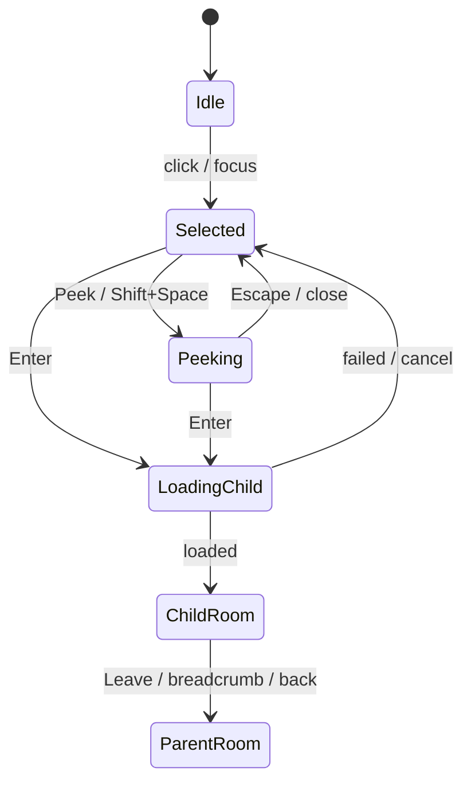
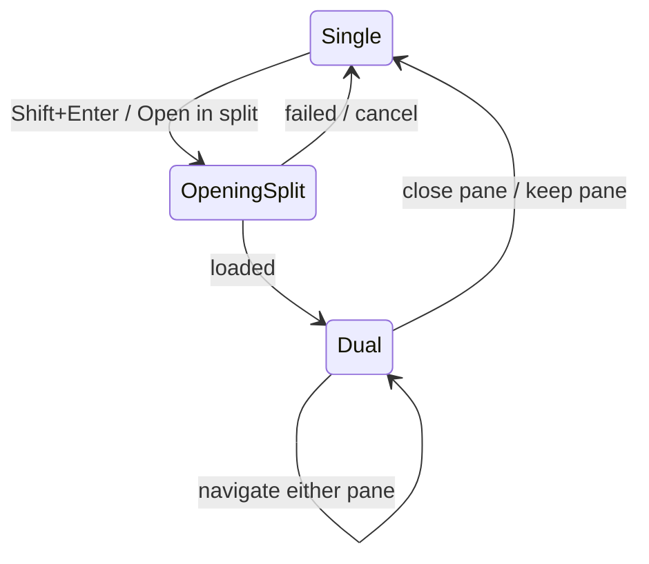
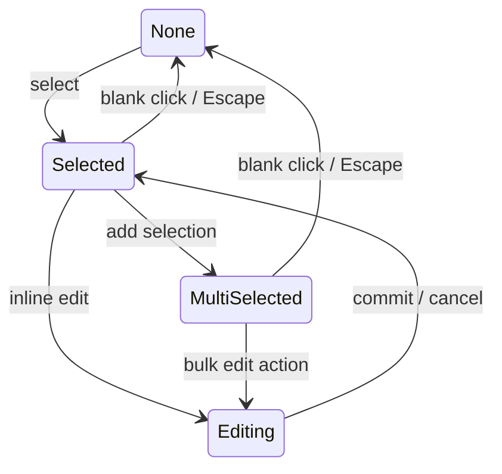
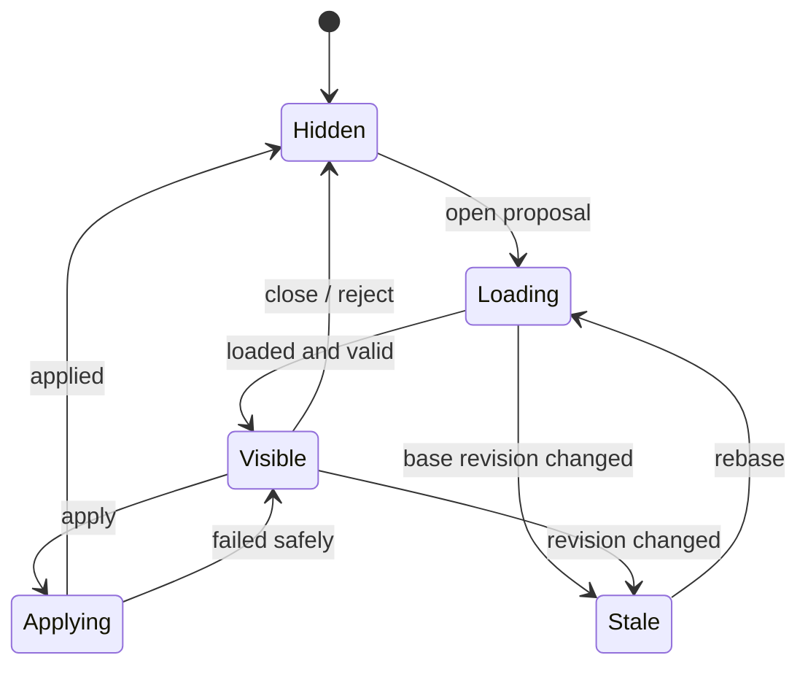

# FlowFold Interaction Specification

- **Status:** Draft
- **Product:** Insightify
- **Feature:** FlowFold Canvas
- **Parent design:** [Insightify System Design](../00-overview/system-design.md)
- **Last updated:** 2026-08-24

FlowFold は、ソフトウェアを抽象から具体へ辿るための再帰的な Flow UI である。本仕様は、Portal、Room、Peek、
Semantic Zoom、Split View、およびそれらを支える selection、camera、navigation、keyboard interaction の
基準挙動を定める。

本仕様の中心原則は、Compound Node を子要素の実寸で膨張する container として扱わず、独立した Scope へ入る
ための Portal として扱うことである。子 Scope の複雑さは親 Scope のレイアウトへ伝播しない。

---

## 0. Normative Language

この文書では次の表現を使用する。

- **MUST:** 仕様適合に必須
- **MUST NOT:** 禁止
- **SHOULD:** 原則として実装する。外す場合は理由を記録する
- **MAY:** 任意拡張

数値は prototype の初期値であり、ユーザーテストで調整できる。ただし数値を変えても、状態遷移と不変条件は
維持しなければならない。

---

## 1. Scope

### 1.1 In Scope

- Canvas と Room の画面構造
- Node、Compound Node、Port、Edge の基本表示
- selection と multi-selection
- pan、zoom、fit、camera restore
- Compound Node への Enter / Leave
- Peek の表示、終了、制約
- Semantic Zoom の level と hysteresis
- Split View の開始、操作、終了
- breadcrumb、history、deep link
- Node の配置、接続、Scope 間移動の入口
- AI Thread composer と ChangeSet preview の Canvas 上の挙動
- loading、empty、stale、conflict の表示
- keyboard、pointer、accessibility
- client UI state と永続 state の境界
- interaction acceptance tests

### 1.2 Out of Scope

- Graph entity の永続 schema
- auto layout algorithm の具体的な最適化手法
- Agent prompt、model、tool execution の内部実装
- Branch merge algorithm
- production runtime trace の取り込み方式
- mobile 専用 UI
- 色、フォント、shadow の最終 visual design

---

## 2. Interaction Goals

FlowFold interaction は次を満たす。

1. ユーザーは現在の抽象度と Scope を常に理解できる。
2. 詳細へ入っても、元の位置と camera を失わない。
3. 子 Scope が巨大でも、親 Scope の Node 配置が変化しない。
4. Node を開かなくても、重要な status、error、active work を把握できる。
5. Peek で軽く確認し、Enter で本格的に作業するという段階を持つ。
6. 二つの Scope を比較するときだけ Split View を使い、通常操作を複雑にしない。
7. AI の会話と提案を Flow の場所へ結び付けつつ、Flow topology と混同しない。
8. 自動 layout、Semantic Zoom、AI proposal によって空間的記憶を不必要に壊さない。
9. すべての主要操作に pointer と keyboard の入口を用意する。
10. animation がなくても同じ状態遷移を理解できる。

---

## 3. Core Mental Model

### 3.1 Scope

Scope は Node と Edge を配置する永続的なローカル座標系である。Scope は Graph domain entity であり、camera、
selection、panel state を所有しない。

### 3.2 Room

Room は Scope を表示・操作している UI 上の viewport である。Room は永続的な Graph entity ではない。

```text
Scope = 保存されるグラフ空間
Room  = Scope を現在表示している作業画面
```

同じ Scope を Split View の左右に同時表示することも理論上可能であるため、Scope と Room を一対一にしない。

### 3.3 Portal

子 Scope を所有する Compound Node の表示・操作上の役割を Portal と呼ぶ。Portal は親 Room 内では通常の
Node と同じ位置、Port、Edge を持つが、Enter、Peek、Open in Split の入口を追加で持つ。

### 3.4 Camera

Camera は Room ごとの pan/zoom state である。

```text
CameraState
├ x
├ y
├ zoom
└ last_user_action_at
```

camera は Scope layout の一部ではない。Node の保存座標を変えず、表示 transform だけを変更する。

### 3.5 Selection

Selection は現在操作対象として選択された Anchor 集合である。Node、Port、Edge を同時に選択できる拡張余地を
持つが、MVP の mixed-kind multi-selection は Node のみ許可する。

---

## 4. Screen Anatomy

### 4.1 Single Room

```text
┌──────────────────────────────────────────────────────────────────────┐
│ Project / Application / Checkout       Design | Build      Search   │ Top bar
├──────────────────────────────────────────────────────────────┬───────┤
│                                                              │       │
│  ┌─────────────── Canvas / active Room ────────────────────┐ │ Insp. │
│  │                                                        │ │ or    │
│  │  [Cart] ───────▶ [Checkout ◇] ───────▶ [Order]         │ │ Thread│
│  │                    3 steps                              │ │       │
│  │                    ● 1 Agent Run                        │ │       │
│  │                                                        │ │       │
│  └────────────────────────────────────────────────────────┘ │       │
│                                              [−] [100%] [+] │       │
├──────────────────────────────────────────────────────────────┴───────┤
│ Activity / proposal / error tray                                    │
└──────────────────────────────────────────────────────────────────────┘
```

構成:

- **Top bar:** Project、breadcrumb、mode、search、global actions
- **Room:** Scope の Node、Port、Edge、overlay
- **Inspector rail:** 選択対象の contract、Artifact、Thread、Run
- **Activity tray:** 実行、proposal、conflict、notification。必要なときだけ開く
- **Camera controls:** zoom、fit、minimap

Inspector rail は Room を覆う floating panel ではなく、desktop では原則としてレイアウト領域を確保する。panel の
開閉で camera center が変わる場合、選択 Node が見切れないよう補正するが、Node 座標は変更しない。

### 4.2 Split View

```text
┌──────────────────────────────────────────────────────────────────────┐
│ Project / Application                                  Search       │
├────────────────────────────────┬─────────────────────────────────────┤
│ Application / Checkout         │ Checkout / Payment                 │
│                                │                                    │
│ [Cart] → [Checkout ◇]          │ [Validate] → [Authorize] → [Order] │
│                                │                  ▲                 │
│                                │                  error             │
│                                │                                    │
├────────────────────────────────┴─────────────────────────────┬───────┤
│ Shared activity / proposal                                  │ Insp. │
└──────────────────────────────────────────────────────────────┴───────┘
```

Split View は最大二つの Room を表示する。MVP では三分割以上を許可しない。

---

## 5. UI State Model

Client は少なくとも次の状態を持つ。

```text
FlowFoldViewState
├ projectId
├ flowId
├ panes
│  ├ primary: RoomState
│  └ secondary?: RoomState
├ activePaneId
├ splitRatio
├ inspectorState
├ activityTrayState
├ mode
├ proposalPreview?
├ composerState?
└ navigationHistory

RoomState
├ roomId
├ scopeId
├ ownerCompoundNodeId?
├ ancestorPath[]
├ camera
├ selection
├ hoveredAnchor?
├ peekState?
└ transientLayoutPreview?
```

### 5.1 State Ownership

| State | Ownership | Persistence |
|---|---|---|
| Node/Port/Edge/Scope | Graph domain | durable、Revision 管理 |
| Node position/size hint | Graph layout state | durable、Revision 管理 |
| current Scope | user navigation | URL + session restore |
| camera per Scope | user preference | local first、optionally server sync |
| selection/hover | client | ephemeral |
| Peek | client | ephemeral |
| Split View and ratio | user workspace | session restore |
| inspector tab | user preference | session restore |
| proposal preview | ChangeSet draft | durable reference + client projection |
| Agent Run live status | realtime mirror | reconnectable |

### 5.2 Scope-local Restore

Room を離れるとき、Scope ごとに camera と直前 selection を保存する。戻ったときは次の順序で復元する。

1. 明示的な deep-link target
2. navigation action が指定した target Node
3. user の直前 camera/selection
4. Scope の fit-to-content 初期 camera

---

## 6. Node and Portal Presentation

### 6.1 Node Frame

すべての Node は共通 frame を持つ。

```text
┌─────────────────────────────────┐
│ status  Title            badges │ Header
├─────────────────────────────────┤
│ purpose / contract summary      │ Body by LOD
├─────────────────────────────────┤
│ evidence / artifact summary     │ Footer by LOD
└─────────────────────────────────┘
   ○ input ports       output ports ○
```

Node frame の persistent layout size は child Scope の大きさと無関係である。ユーザー resize または Node kind の
default size は許可するが、子孫追加による自動 resize は禁止する。

### 6.2 Portal Affordance

Compound Node は次で Portal であることを示す。

- title 横の Portal glyph
- child Node count または summary
- header の Enter action
- hover/focus 時の Peek action
- context menu の Open in Split

Portal glyph だけに意味を依存せず、accessible name に「内部フローあり」を含める。

### 6.3 Aggregated Status

Compound Node は子 Scope の重要状態を summary へ集約する。

優先順位:

1. conflict / unsafe destructive proposal
2. failed verification / blocked Run
3. awaiting approval
4. active Agent Run
5. unresolved blocking Thread
6. stale evidence / drift
7. done summary

低い優先度の成功状態が、高い優先度の問題を隠してはならない。

### 6.4 Ports

- data/control input は原則として左、output は右へ置く。
- error Port は下側へ置ける。
- layout direction が縦の場合は top/bottom へ適応してよい。
- Port の種類は形状と label の両方で区別する。
- L0 でも接続済み主要 Port は表示する。
- Port 数が多い場合、低優先度 Port を group できるが、接続 status と error を隠さない。

---

## 7. Selection

### 7.1 Pointer Selection

| Action | Result |
|---|---|
| Node click | 単一選択、inspector 更新 |
| Edge click | Edge 単一選択、inspector 更新 |
| Port click | Port 単一選択、接続 action 表示 |
| blank click | selection clear |
| Shift+Node click | Node selection へ追加/除外 |
| drag on blank | selection rectangle |
| context click | 対象を選択して context menu |

Node 内部の button、link、input 操作は Node drag/select より優先する。

### 7.2 Keyboard Selection

- `Tab` は visible Node/Port/action を logical order で移動する。
- Arrow key は spatial nearest Node へ selection を移動する。
- `Shift+Arrow` は Node multi-selection を拡張する。
- `Escape` は最も内側の transient state を一段だけ閉じる。
- selection がある状態の `Escape` は selection clear だけを行い、同じ keypress で Leave まで実行しない。

### 7.3 Selection Persistence

- Semantic Zoom level が変わっても selection を保持する。
- Node が viewport 外へ出ても selection を保持する。
- Scope を Leave したときは Scope-local selection として記録する。
- 削除 proposal 中の Node は preview が終わるまで selectable である。
- current Revision で削除済みになった Anchor は stale selection として inspector に履歴を表示する。

### 7.4 Multi-selection Limits

MVP では同一 Scope 内の Node のみ multi-selection できる。異なる Scope の Node は Split View で個別 selection し、
必要なら Thread の multi-anchor として明示的に追加する。

---

## 8. Camera: Pan, Zoom, and Fit

### 8.1 Pointer and Trackpad

| Input | Result |
|---|---|
| trackpad two-finger move | pan |
| trackpad pinch | zoom around pointer |
| mouse wheel | vertical pan |
| Shift+mouse wheel | horizontal pan |
| Ctrl/Cmd+mouse wheel | zoom around pointer |
| middle-button drag | pan |
| Space+primary drag | pan |

browser/page zoom と Canvas zoom を混同しない。Ctrl/Cmd+`+`、`-` の扱いは browser shortcut を奪わず、Canvas
上の dedicated controls と plain `+`/`-` shortcut を使用する。

### 8.2 Zoom Bounds

初期値:

- minimum: 10%
- maximum: 400%
- button step: 20% relative
- keyboard step: 10% relative

zoom bound 到達時に Node geometry を変更しない。

### 8.3 Fit Commands

- **Fit All (`1`):** 現在 Scope の主要 Node を viewport へ収める。
- **Fit Selection (`2`):** selection を inspector に隠れない領域へ収める。
- **Actual Size (`0`):** 100% へ戻し、pointer または selection を中心にする。
- **Center Selection (`F`):** zoom を変えず selection を中央へ移す。

Fit All は unplaced draft、hidden layer、proposal で削除予定の Node を既定の bounding box へ含めない。表示 option で
含めることはできる。

### 8.4 Camera Stability

- inspector open/close で選択 Node が完全に隠れる場合のみ camera を最小限補正する。
- Thread badge、status、label の変化で camera を動かさない。
- auto layout preview では camera を維持する。
- apply 後に新規 Node が viewport 外なら、勝手に Fit All せず「新規 Node へ移動」action を表示する。

---

## 9. Semantic Zoom

### 9.1 Principle

Semantic Zoom は Node の画面上の大きさに応じて情報量を切り替える。フォントを読めない大きさまで縮小して
全情報を残す方式は禁止する。

Semantic Zoom は表示 projection だけを変え、次を変更しない。

- Node の Graph identity
- Node の persistent position/size
- Port/Edge topology
- selection
- Thread/Run Anchor
- active proposal

### 9.2 Levels

初期 level 判定は Node の projected width を基本にする。body の projected height が level の内容を表示するには
不足する場合だけ、一段低い level を選ぶ。

| Level | Enter threshold | Visible information |
|---|---:|---|
| L0 Overview | `< 72px` | shape、title abbreviation、status、major Ports |
| L1 Summary | `>= 72px` | full title、purpose one line、child/status count |
| L2 Contract | `>= 144px` | key inputs/outputs、evidence、Thread/Run badges |
| L3 Detail | `>= 280px` | expanded contract summary、Artifact summary、Portal actions |

Node の aspect ratio により body の実効高さが不足する場合は一段低い level を選ぶ。

### 9.3 Hysteresis

threshold の上下 12% を hysteresis band とし、同じ境界付近で level が連続反転することを防ぐ。

例:

- L1 から L2 へ上がる: 144px 以上
- L2 から L1 へ戻る: 127px 未満

### 9.4 LOD Transition

- level change は 100–160ms の opacity/position transition を MAY とする。
- Node frame と Port position は level change で jump させない。
- `prefers-reduced-motion` では transition を無効化する。
- focus 中の interactive input は level change で unmount しない。編集開始時は L2 以上を一時固定する。

### 9.5 Semantic Priority

情報を省略する優先順位:

1. decorative metadata
2. successful evidence detail
3. inactive Thread count detail
4. purpose detail
5. optional Port label

省略してはならないもの:

- blocking/conflict/failed status
- active Agent Run
- selected/focused indication
- connected required Port
- destructive proposal indication

### 9.6 Portal and Semantic Zoom

Semantic Zoom が L3 になっても子 Scope の full contents を Node 内へ mount しない。L3 は Portal summary と action を
増やす level であり、再帰的な live canvas 展開ではない。

---

## 10. Enter and Leave

### 10.1 Enter Preconditions

次のすべてを満たす Node だけ Enter できる。

- Compound Node である。
- user が child Scope を read できる。
- child Scope の identity が解決できる。

loading 中または access denied の Portal は、その状態を action 上で明示する。

### 10.2 Enter Inputs

| Input | Result |
|---|---|
| Portal double click | primary pane で Enter |
| selected Portal + Enter | primary/active pane で Enter |
| Portal header の Enter button | active pane で Enter |
| selected Portal + Shift+Enter | secondary pane で開く |
| context menu: Open in split | secondary pane で開く |

single click は selection のみとし、Enter しない。Node を選びたい操作と階層移動を分ける。

### 10.3 Enter Transition

1. current Scope の camera と selection を保存する。
2. target child Scope の read を開始する。
3. Portal frame を一時的な transition origin とする。
4. data ready 後、child Room を表示する。
5. breadcrumb、URL、history を更新する。
6. target Scope の camera/selection を restore rule に従って復元する。

通常 animation は 180–240ms を初期値とする。Portal が viewport 外、deep link、reduced motion の場合は fade または
即時切替にする。

### 10.4 Loading During Enter

- 150ms 未満の load では full-screen skeleton を表示しない。
- 150ms を超えた場合、Portal origin から展開する lightweight skeleton を表示する。
- current Room は data ready まで保持し、空白画面へ先に切り替えない。
- load 失敗時は current Room に留まり、Portal 上と notification に retry を表示する。

### 10.5 Leave Inputs

| Input | Result |
|---|---|
| breadcrumb ancestor click | 指定 ancestor Scope へ移動 |
| Back button | navigation history の前 Room へ戻る |
| `Alt+Left` | Back と同じ |
| top bar の Up action | 直接 parent Scope へ移動 |
| `Esc` | transient UI がなく、Canvas focus 時のみ parent へ Leave |

`Esc` の優先順位は Section 20.4 に従う。編集中、Peek、composer、menu が開いている状態で Leave してはならない。

### 10.6 Parent Re-entry Focus

child Scope から parent へ戻ると、owner Compound Node を selection にし、保存済み camera を復元する。Portal が
viewport 外にある場合のみ、Portal が見える最小限の camera 補正を行う。

### 10.7 Root Scope

Root Scope で Up/Leave は disabled。Back history が存在する場合の Back は history を優先する。

---

## 11. Breadcrumb and Navigation History

### 11.1 Breadcrumb

breadcrumb は active pane の Structure Graph path を表示する。

```text
Project / Application / Checkout / Payment
```

- 最後の項目は current Scope owner の label。
- ancestor click はその Scope へ直接移動する。
- 省略時も最初、直近 ancestor、current を残す。
- hidden segments は menu から選択できる。
- breadcrumb は Flow の実行 Edge ではなく Structure path を表す。

### 11.2 Browser History

Enter、Leave、breadcrumb navigation、Open deep link は browser history entry を作る。camera pan/zoom、selection、Peek、
inspector tab は history entry を作らない。

### 11.3 URL

概念 URL:

```text
/projects/{projectId}/flows/{flowId}/scopes/{scopeId}?node={nodeId}
```

Split View は shareable option として secondary Scope を query に含めてもよいが、MVP では primary Scope の deep link
だけを必須とする。

### 11.4 Stale Deep Link

- Scope が current Revision で存在しない場合、最新 ancestor または Project root を表示する。
- 「対象は Revision X で削除された」と明示する。
- permission denied と not found を user-facing message では必要に応じて同一化するが、監査ログでは区別する。

---

## 12. Peek

### 12.1 Purpose

Peek は child Scope の構造と重要状態を、current Room を離れず短時間確認する read-only preview である。Peek は
本格的な nested editor ではない。

### 12.2 Open Inputs

| Input | Result |
|---|---|
| Portal hover/focus | Peek button を表示。自動では開かない |
| Peek button click | Peek を固定表示 |
| selected Portal + `Shift+Space` | Peek を開く/閉じる |
| context menu: Peek | Peek を固定表示 |

Space 単独は Canvas pan に予約する。hover だけで full Peek を開かず、pointer が Node 間を通るたび画面が変化する
ことを防ぐ。

### 12.3 Peek Surface

```text
       ┌──────────── Portal ────────────┐
       │ Checkout                  ◇    │
       └──────────────┬─────────────────┘
                      │
          ┌───────────▼ Peek ─────────────────┐
          │ Checkout Room                     │
          │ [Validate] → [Payment] → [Order] │
          │ 1 failed test · 1 active Thread   │
          │                    [Enter] [Split] │
          └────────────────────────────────────┘
```

Peek は次を表示する。

- child Scope の fit-to-content mini-map
- 主要 Node title と status
- blocking/conflict/active Run summary
- child count と last updated
- Enter / Open in Split actions

### 12.4 Peek Constraints

- read-only とする。
- child Node の full inspector を内部に開かない。
- Node drag、Edge create、inline edit を許可しない。
- child Node click は highlight と短い tooltip までとし、selection を current Room から奪わない。
- Peek 内の child Portal からさらに再帰 Peek を開かない。
- live iframe、editor、terminal、Thread composer を mount しない。
- 表示 Node 上限を超える場合は集約表示し、Enter を促す。

これにより Peek 自体が paper-in-paper の余白・performance 問題を再導入することを防ぐ。

### 12.5 Placement

Peek surface は Portal の近傍へ置くが、viewport と inspector に収まる方向を優先する。Portal を完全に覆わない。
空き領域が不足する場合は中央 modal ではなく、右側の temporary preview rail へ fallback する。

### 12.6 Close

- `Escape`
- Peek button 再押下
- close action
- 別 Node の Enter
- current Scope navigation

固定表示された Peek は pointer leave だけでは閉じない。非固定 hover preview は将来拡張とし、MVP では実装しない。

### 12.7 Loading and Error

- summary cache があれば即表示し、詳細を background refresh する。
- load 中は child count と last known status を維持する。
- load 失敗時も Enter action は retry-capable とする。

---

## 13. Split View

### 13.1 Purpose

Split View は次の用途に限定する。

- parent Scope と child Scope の契約比較
- producer と consumer の比較
- Flow と Artifact/Run evidence の並行確認
- 二つの代替 Branch の将来比較

通常 navigation の既定にはしない。

### 13.2 Opening

- selected Portal + `Shift+Enter`
- Portal context menu: Open in split
- Peek の Split action
- reference/Boundary Binding inspector の Open related scope in split

secondary pane が既に存在する場合は、置換前に unsaved inline edit と pinned inspector を確認する。Graph edit は
ChangeSet draft として durable なら置換を阻止しない。

新しく開いた pane を active pane とする。既に二つの pane がある状態で `Open in split` を実行した場合、action を
開始した source pane を残し、反対 pane を置換する。

### 13.3 Pane Rules

- 最大二つの Room。
- 各 pane は独立した Scope、camera、selection、breadcrumb を持つ。
- active pane は focus ring と top bar context で明示する。
- keyboard shortcut と inspector は active pane を対象にする。
- divider は draggable。初期比率は 50:50、最小 pane 幅は 320px。
- viewport が狭すぎる場合、tabbed dual-room へ degrade する。

### 13.4 Inspector

MVP は一つの shared inspector を使用し、active pane の selection を表示する。反対 pane の selection は保持するが、
inactive style にする。

比較専用 inspector は後続拡張とする。

### 13.5 Cross-pane Relations

異なる pane 間へ長い Edge を直接描画しない。関連は次で示す。

- related Node の pulse/highlight
- pane edge の relation marker
- inspector の Boundary Binding
- 「反対側で表示」action

cross-pane relation marker を hover/select すると両端を同時 highlight する。

### 13.6 Camera Linking

camera は既定で独立する。異なる Scope は座標系が異なるため、pan/zoom の同期は行わない。同一 Scope/Branch 比較の
将来機能では explicit `Link cameras` option を追加できる。

### 13.7 Drag Between Panes

MVP では Node を pane 間 drag して Scope 移動しない。誤操作で Boundary Binding と Edge を大量変更する危険がある。
Scope 間移動は Move to Scope command から ChangeSet preview を生成する。

### 13.8 Closing

- secondary pane close action
- `Shift+Escape` when no transient UI is open
- context menu: Keep this pane only

secondary pane を閉じても camera/selection を Scope-local state として保持する。どちらを primary に残すかは user が
選べる。close button は押された pane を閉じ、もう一方を primary にする。

---

## 14. Node Movement and Layout Editing

### 14.1 Move Within Scope

- Node body/header drag で同一 Scope 内を移動する。
- Port、button、text selection、input から drag を開始しない。
- drag threshold は 4px を初期値とし、click と誤判定しない。
- multi-selection drag は選択 Node 間の相対位置を維持する。
- drop 後に persistent position operation を作る。

### 14.2 Grid and Alignment

- free placement を基本とし、optional grid snap を提供する。
- alignment guide は同一 Scope の visible Node を対象にする。
- Semantic Zoom level に関係なく model coordinate で snap する。
- keyboard move は `Alt+Arrow` で 1 unit、`Alt+Shift+Arrow` で 10 units を初期値とする。

### 14.3 Auto Layout

auto layout は直接適用せず preview を表示する。

- 既存 manual position を locked/unlocked として区別する。
- 既定では unlocked Node と新規 Node だけを再配置する。
- apply 前に before/after を切り替えられる。
- cancel で元 position を完全に保持する。
- child Scope の auto layout は parent Scope を変更しない。

### 14.4 Resize

Node は Node kind ごとの minimum/maximum 内で resize できる。Compound Node の resize は親 Room 上の Portal summary
表示量を変えるだけで、child Scope の layout を変えない。

### 14.5 Move Across Scope

Scope 間移動は次の手順とする。

1. Node を選択。
2. Move to Scope action。
3. target Scope を search/tree picker で選択。
4. Edge と Boundary Binding の影響 preview。
5. invalid cross-scope connection の解決候補を表示。
6. ChangeSet として apply。

Portal 上への drag-and-drop で暗黙に reparent する挙動は MVP では採用しない。

---

## 15. Creating and Connecting Nodes

### 15.1 Create Node

入口:

- blank canvas double click
- toolbar Add Node
- keyboard `N`
- Port から blank area へ connection drag
- AI ChangeSet proposal

新規 Node は draft 状態で現在 Scope に作成し、title editor を開く。title 確定前でも stable temporary ID を持つ。

### 15.2 Create Compound Node

Node 作成時または後から `Add child Scope` を選ぶ。child Scope 作成後、その Node は Portal affordance を持つ。

既存 Node 群を選択して `Fold into Compound Node` を実行する場合:

1. 新しい Compound Node と child Scope を proposal する。
2. 選択 Node を child Scope へ移す。
3. 外部接続を Boundary Port へ変換する。
4. ambiguous な Edge mapping を user decision として表示する。
5. preview 後に一つの ChangeSet で apply する。

### 15.3 Connect Ports

- source Port drag で compatible target を highlight する。
- incompatible target は disabled style と理由 tooltip を表示する。
- drop 前に Edge kind、schema、direction を検証する。
- blank drop では compatible Port を持つ Node 作成 menu を MAY とする。
- 既存 Edge の endpoint 変更も ChangeSet operation とする。

### 15.4 Edge Selection

Edge hit area は見た目の線より広くする。選択時に endpoints、kind、contract summary、related Thread/Run を inspector
へ表示する。

### 15.5 Delete

Delete key は即時削除せず、local proposal または confirmable ChangeSet を作る。

- 未接続 draft Node は lightweight undo toast で削除してよい。
- 接続済み Node、Compound Node、Boundary Port、Artifact Link 付き Node は影響 preview を必須とする。
- Compound Node の cascade delete を既定選択にしない。delete only / lift children / archive branch を比較する。

---

## 16. Inspector

### 16.1 Tabs

Node inspector の初期 tab:

- Overview
- Contract
- Artifacts
- Threads
- Runs
- Evidence
- History

Edge inspector:

- Contract
- Threads
- Evidence
- History

Port inspector:

- Schema
- Connections
- Boundary Mapping
- History

### 16.2 Inline Edit

title や短い purpose は Canvas 上で inline edit できる。複雑な contract は inspector で編集する。

- Enter: commit
- Shift+Enter: newline when supported
- Escape: cancel current field edit
- blur: dirty content があれば commit/cancel policy を明示する。MVP は commit

inline edit 中に Semantic Zoom で editor を消さない。Room navigation 前に edit を commit または確認する。

### 16.3 Inspector Pin

inspector を特定 Anchor に pin できる。pin 中に Canvas selection が変わっても内容を維持する。Split View では pin
が pane ID も保持する。

---

## 17. Anchored AI Composer

### 17.1 Open

入口:

- Node/Edge/Port の Ask AI action
- selection toolbar
- Canvas global composer
- keyboard `/` または `A`。text input 中は発火しない
- error/evidence badge の Investigate action

Anchor の既定:

- selection があれば selection
- selection がなければ current Scope
- inspector で選択 text があれば text + owning Anchor

### 17.2 Composer Placement

単一 Anchor では対象近傍に compact composer を表示する。入力開始後または response が長くなったら Thread rail へ
昇格する。composer が Node/Edge を完全に覆わないよう placement する。

### 17.3 Anchor Chips

composer は AI に渡る主要 Anchor を chip で表示する。

```text
[Payment Node] [timeout Edge] [+ Add context]
```

自動選択される周辺 context は送信後の provenance panel で確認できる。user-pinned Anchor は自動で外さない。

### 17.4 Intent and Mutation

ユーザーは Ask/Edit/Implement を先に選ぶ必要はない。LLM が intent を返す。ただし mutation intent は必ず
proposal preview へ進み、直接 Graph/Artifact を変更しない。

### 17.5 Thread Badge

Node/Edge 上には未解決 Thread、active Thread、Decision 数を badge として表示する。Thread card を Flow Node として
Room 内へ配置しない。

### 17.6 Multiple Threads

同一 Anchor に複数 Thread を作成できる。Thread list は status、title、last activity、Decision/Open Question summary
で区別する。新しい論点を既存 Thread へ自動混入しない。

---

## 18. ChangeSet Preview on Canvas

### 18.1 Preview Mode

ChangeSet preview 中も pan、zoom、selection、Peek、Split navigation を許可する。通常 Graph edit は affected entity の
競合を避けるため一時的に disabled にする。

### 18.2 Visual Language

| Change | Projection |
|---|---|
| create | green/positive ghost |
| update | before/after highlight、field diff badge |
| delete | red/negative outline、strike/ghost |
| move | origin ghost + destination solid preview |
| reconnect | old Edge dashed + new Edge solid preview |
| conflict | amber conflict marker |
| validation failure | target-local error badge |

色だけで意味を伝えず、icon、line pattern、label を併用する。

### 18.3 Preview Scope

ChangeSet が複数 Scope に影響する場合:

- current Scope の変更を Canvas に表示する。
- 他 Scope の変更数を breadcrumb/impact list に表示する。
- Open affected scope in split を提供する。
- 全 Scope を一枚へ展開しない。

### 18.4 Actions

- Apply all
- Review details
- Edit proposal
- Rebase
- Reject
- Save as Branch

partial apply は ChangeSet policy が許す場合だけ表示する。

### 18.5 Stale Preview

base Revision が current Revision より古くなった場合、Apply を disabled にし、Rebase と Compare を表示する。
ghost を current Graph 上へ無検証で再投影しない。

---

## 19. Design, Build, and Run Layers

### 19.1 Design

- Node、Port、Edge、Contract を主表示する。
- Thread/Run は小さい status badge に抑える。
- Graph edit action を有効にする。

### 19.2 Build

- active Run、Branch、lease、ChangeSet、Artifact diff を強調する。
- Flow topology は位置 context として維持する。
- Node の実装 status と write set を表示する。

### 19.3 Run

- test/runtime trace、latency、error、retry を投影する。
- Graph edit は可能だが primary action ではない。
- MVP では test Evidence overlay までとする。

### 19.4 Layer Switching

layer 切替で Scope、camera、selection を変更しない。同じ場所の異なる projection として扱う。active proposal と
Agent Run status はどの layer でも最低限の警告を残す。

---

## 20. Keyboard Interaction

### 20.1 Navigation and Camera

| Shortcut | Action |
|---|---|
| Space+drag | pan |
| `+` / `-` | Canvas zoom in/out |
| `0` | 100% |
| `1` | Fit All |
| `2` | Fit Selection |
| `F` | Center Selection |
| Enter | selected Portal へ Enter |
| Shift+Enter | selected Portal を Split で開く |
| Shift+Space | selected Portal を Peek |
| Alt+Left | navigation Back |
| Alt+Right | navigation Forward |
| Shift+Escape | secondary pane を閉じる |

### 20.2 Editing

| Shortcut | Action |
|---|---|
| `N` | Node 作成 |
| `/` or `A` | AI composer |
| Delete/Backspace | delete proposal |
| Cmd/Ctrl+Z | inverse/local undo policy に従う |
| Cmd/Ctrl+Shift+Z | redo |
| Arrow | spatial selection move |
| Shift+Arrow | spatial selection extend |
| Alt+Arrow | selected Node を 1 unit 移動 |
| Alt+Shift+Arrow | selected Node を 10 units 移動 |

### 20.3 Shortcut Scope

text input、code editor、terminal、browser dialog に focus がある場合、Canvas shortcut を発火しない。Escape、
approval shortcut も editor 側の操作を先に処理する。

### 20.4 Escape Priority

Escape は一度に一段だけ閉じる。

1. context menu / tooltip
2. inline edit cancel
3. composer suggestion / dialog
4. Peek
5. unpinned inspector overlay
6. proposal detail overlay
7. selection clear
8. parent Scope へ Leave

destructive confirmation と active Agent approval は Escape で暗黙承認・暗黙拒否しない。

### 20.5 Shortcut Help

`?` で current context に有効な shortcut help を開く。Portal selection、Split View、proposal preview などに応じて
内容を絞る。

---

## 21. Pointer and Touch

### 21.1 Pointer Priority

hit testing priority:

1. modal/dialog
2. Node interactive control
3. Port
4. Edge handle
5. Node body
6. Edge stroke hit area
7. Canvas

iframe content を Node card 内へ使用する場合、host interaction との境界を明示し、iframe 上での pan/selection を
誤取得しない。FlowFold Node summary では原則として host-native structured content を使用する。

### 21.2 Hover

hover だけで Graph state、selection、navigation、Peek を変更しない。hover は affordance と tooltip の表示に限定する。

### 21.3 Touch

MVP は desktop-first。touch では最低限、tap select、double tap Enter、pinch zoom、two-finger pan、long press context
menu を提供する。精密な Port connection と multi-selection は desktop を推奨する。

---

## 22. Accessibility

### 22.1 Keyboard Equivalence

主要 pointer action は keyboard でも実行可能にする。double click だけを唯一の Enter 手段にしない。

### 22.2 Focus

- DOM focus と Canvas selection を視覚的に区別する。
- focus ring は zoom level に関係なく最低 2 CSS px 相当を維持する。
- Portal の accessible name に child Scope と status summary を含める。
- live Agent progress は過剰に読み上げず、重要 state transition のみ aria-live へ通知する。

### 22.3 Outline View

Canvas と同じ Graph を list/tree で操作できる Outline View を提供する。

- Structure path を tree として表示
- current Scope 内 Node と主要 Edge を list 表示
- selection、Enter、Thread open、status 確認
- Canvas と双方向に selection 同期

Canvas だけへ accessibility を押し込まず、同じ operation を別 projection から実行できるようにする。

### 22.4 Color and Motion

- status、proposal、Edge kind は色だけに依存しない。
- `prefers-reduced-motion` で Portal transition、pulse、auto-pan を無効化する。
- flashing/pulse は短時間かつ低頻度にし、常時 animation しない。

---

## 23. Animation

### 23.1 Principles

animation は位置関係と状態遷移を説明するために使用し、待機時間や装飾目的で増やさない。

初期値:

| Transition | Duration |
|---|---:|
| hover/focus affordance | 80–120ms |
| Semantic Zoom content | 100–160ms |
| inspector open/close | 160–200ms |
| Portal Enter/Leave | 180–240ms |
| Split open/close | 180–240ms |
| proposal ghost change | 120–180ms |

### 23.2 Interruption

animation 中の user input は受け付ける。Enter transition 中の Back は current/target の中間 DOM 状態を残さず、
最後に確定した Room または target Room のいずれかへ収束させる。

### 23.3 Reduced Motion

reduced motion では cross-fade も最小限とし、focus と breadcrumb の更新で遷移を説明する。

---

## 24. Performance and Virtualization

### 24.1 Mount Policy

MUST mount:

- primary Room の visible Node/Edge
- secondary Room の visible Node/Edge
- overscan 範囲
- active edit/composer/proposal target

MUST NOT 常時 mount:

- 閉じた child Scope の full Node tree
- breadcrumb ancestor Room 全体
- Peek 内の live child components
- viewport から大きく離れた heavy Artifact preview

### 24.2 Portal Summary Cache

Portal は child Scope 全体を mount せず、materialized summary を読む。

```text
ScopeSummary
├ node_count
├ edge_count
├ status_counts
├ blocking_count
├ active_run_count
├ unresolved_thread_count
├ last_updated_at
└ preview_layout_snapshot?
```

summary が stale の場合は明示し、子 Scope を開かずに正確な live count を計算するため全 Graph を client へ
読み込まない。

### 24.3 Virtualization and Selection

virtualized Node が selection された場合、model selection は保持する。inspector は data model から表示し、Node DOM が
存在することへ依存しない。Center Selection を実行したとき対象周辺を mount する。

### 24.4 Target Budgets

prototype の評価 target:

- Room navigation visual response: 100ms 以内に feedback
- warm Scope Enter: 250ms 以内に usable
- pan/zoom: 60fps target、30fps 未満の継続を failure とする
- 1,000 Node Scope: virtualization 下で navigation/selection が可能
- Peek open: cached summary で 100ms 以内

network と hardware 条件を記録し、絶対保証ではなく比較可能な評価条件として使用する。

---

## 25. Empty, Loading, and Error States

### 25.1 Empty Scope

```text
This Room has no nodes yet.

[Describe with AI] [Add Node] [Import from code]
```

empty state 自体を巨大な Node として Graph に保存しない。

### 25.2 Permission Denied Portal

Portal は外部契約上見える必要がある場合、title と boundary Port を残し、内部は locked と表示する。Peek/Enter は
permission message を出す。権限のない child Node title を summary に漏らさない。

### 25.3 Deleted or Moved Target

Thread/notification から削除済み Node へ移動した場合、current Revision での lineage と last known location を表示する。
移動済みなら「現在位置へ移動」を提案する。

### 25.4 Layout Failure

auto layout が失敗しても manual layout と Graph data を失わない。fallback placement と diagnostics を表示し、
Graph mutation を rollback しない。

### 25.5 Partial Data

Node data はあるが Artifact/Thread/status が取得できない場合、Node topology を表示し続け、該当 layer だけ unavailable
とする。Canvas 全体を error boundary で置換しない。

---

## 26. Commands and Events

UI component は直接 Graph state を変更せず、command/action を dispatch する。

### 26.1 Navigation Commands

```text
ENTER_SCOPE { paneId, compoundNodeId }
LEAVE_SCOPE { paneId, targetAncestorScopeId? }
OPEN_PEEK { paneId, compoundNodeId }
CLOSE_PEEK { paneId }
OPEN_IN_SPLIT { sourcePaneId, compoundNodeId }
CLOSE_PANE { paneId }
SET_ACTIVE_PANE { paneId }
SET_SPLIT_RATIO { ratio }
RESTORE_ROOM { paneId, scopeId, camera, selection? }
```

### 26.2 Camera and Selection Commands

```text
SET_CAMERA { paneId, camera }
FIT_SCOPE { paneId }
FIT_SELECTION { paneId }
SELECT_ANCHOR { paneId, anchor, mode }
CLEAR_SELECTION { paneId }
SET_HOVERED_ANCHOR { paneId, anchor? }
```

### 26.3 Interaction Commands

```text
START_INLINE_EDIT { anchor, field }
COMMIT_INLINE_EDIT { draft }
CANCEL_INLINE_EDIT
OPEN_COMPOSER { anchors[] }
OPEN_THREAD { threadId }
PREVIEW_CHANGESET { changeSetId }
CLOSE_CHANGESET_PREVIEW
REQUEST_MOVE_TO_SCOPE { nodeIds[], targetScopeId }
REQUEST_AUTO_LAYOUT { scopeId, options }
```

### 26.4 Domain Boundary

`ENTER_SCOPE`、`SET_CAMERA`、`OPEN_PEEK` は view action であり Graph Revision を作らない。

`CREATE_NODE`、`MOVE_NODE`、`CONNECT_PORTS`、`UPDATE_CONTRACT` は Graph operation を含む ChangeSet を作る。prototype
では local immediate edit を許しても、最終 architecture では同じ operation shape に収束させる。

### 26.5 Analytics Events

command と analytics event を同一にしない。analytics は user consent と privacy policy に従い、command payload の
title、content、source code を送信しない。

---

## 27. Interaction State Machines

### 27.1 Portal Navigation



### 27.2 Split View



### 27.3 Selection and Editing



### 27.4 ChangeSet Preview



---

## 28. Acceptance Criteria

### 28.1 Portal and Room

- Compound Node の child Scope に 1,000 Node があっても、親 Node の stored size は変化しない。
- Enter 前後で親 Scope の Node positions が変化しない。
- Leave 後に親 Scope の camera と owner Portal selection が復元される。
- single click は Enter せず selection だけを変える。
- keyboard Enter でも pointer double click と同じ child Scope へ入れる。
- root Scope では Up/Leave が disabled。

### 28.2 Peek

- Peek を開いても current Scope、camera、selection が変化しない。
- Peek 内で Graph を編集できない。
- Peek から再帰 Peek を開けない。
- Peek loading failure 後も current Room を操作できる。
- cached summary がある場合、child Scope full graph を取得せず Peek を表示できる。

### 28.3 Semantic Zoom

- zoom boundary 付近で LOD が frame ごとに反転しない。
- LOD 変更後も Node selection、Port/Edge topology、Thread Anchor を保持する。
- L3 でも child Scope full canvas を mount しない。
- failed/conflict/active Run indication はすべての level で確認できる。
- inline edit 中の field は LOD 変更で消えない。

### 28.4 Split View

- 左右 Room が独立 camera と selection を保持する。
- shortcut は active pane のみに作用する。
- pane 間に実線の cross-scope Edge を描かない。
- secondary pane close 後も primary Room の camera は変化しない。
- 320px 未満になる場合は divider を止めるか tabbed view へ degrade する。
- pane 間 drag で Node を暗黙に reparent できない。

### 28.5 AI and Proposal

- composer が単一 Node、Edge、Scope、multi-selection を Anchor にできる。
- Thread badge は Flow topology の Node/Edge を追加しない。
- mutation intent は ChangeSet preview なしに適用されない。
- 複数 Scope に影響する proposal は impact list と affected Scope navigation を表示する。
- stale proposal は Apply できず、Rebase/Compare を要求する。

### 28.6 Accessibility

- pointer なしで select、Enter、Leave、Peek、Split、composer open ができる。
- reduced motion で同じ最終状態へ到達できる。
- Outline View から current Scope と Portal を移動できる。
- status/proposal/Edge kind を色以外でも識別できる。

---

## 29. Prototype Evaluation

### 29.1 Test Scenes

最低限、次の fixture を用意する。

1. **Wide:** 30 sibling Node、長い横 Flow
2. **Deep:** 8 階層の Compound Node
3. **Dense:** 100 Node、300 Edge、複数 Edge kind
4. **Huge child:** 親 5 Node、ある Portal の child Scope に 1,000 Node
5. **Active work:** Thread、Run、failed Evidence、proposal が同時存在
6. **Split boundary:** parent/child Scope の Boundary Port 比較
7. **Accessibility:** keyboard/Outline View のみで同じ task を実行

### 29.2 User Tasks

- root から特定の深い Node へ移動し、元の場所へ戻る。
- child Scope の error 有無を、Enter せず確認する。
- parent と child の Port contract を Split View で比較する。
- Node と Edge を Anchor に AI Thread を開始する。
- AI proposal が影響する複数 Scope を確認して apply/reject を判断する。
- failed test の場所を見つけ、修正 Thread を開始する。

### 29.3 Measures

- task completion time
- wrong Scope navigation count
- unnecessary pan/zoom count
- camera/position loss の自己申告
- Peek から Enter へ移行した割合
- Split View を開いた理由と close までの時間
- proposal impact の見落とし
- keyboard-only completion rate
- frame time と mount Node 数

### 29.4 Success Signals

- 深い階層でも breadcrumb を見て現在位置を説明できる。
- parent Room へ戻ったとき、目的の Portal を探し直す必要がない。
- child complexity が増えても parent layout の見た目が変わらない。
- Peek と Enter の用途を説明なしで区別できる。
- Split View が常設 multi-pane IDE ではなく、比較のために使われる。
- AI proposal の変更場所と影響範囲を、transcript を読まず説明できる。

---

## 30. Decisions

本仕様で確定する interaction decision:

1. Scope は永続 Graph entity、Room は Scope を表示する UI viewport とする。
2. Compound Node は Portal であり、子 Scope の実寸で自動拡張しない。
3. single click は selection、double click/Enter は Portal Enter とする。
4. Space は pan に予約し、Peek は明示 action または `Shift+Space` とする。
5. hover だけで full Peek を自動表示しない。
6. Peek は read-only、一階層、非再帰、非 live-canvas とする。
7. Semantic Zoom L3 でも child Scope を Node 内へ mount しない。
8. Semantic Zoom は hysteresis を持ち、selection/topology を変更しない。
9. Split View は最大二つの独立 Room とする。
10. Split View の pane 間に長い cross-scope Edge を描画しない。
11. pane 間 drag で Node を暗黙に reparent しない。
12. Scope 間移動と Fold into Compound Node は ChangeSet preview を必要とする。
13. Design/Build/Run layer 切替で Scope、camera、selection を変更しない。
14. child Scope の full graph を Portal summary のために常時 client へ読み込まない。
15. navigation、camera、selection、Peek は Graph Revision を作らない。

---

## 31. Open Questions

### Prototypeで決める

- LOD threshold の初期値 `72 / 144 / 280px` が実際の Node density に合うか。
- Peek surface を Node 近傍 popover と preview rail のどちらへ寄せるか。
- Portal Enter animation が空間理解を助けるか、遅く感じるか。
- `Shift+Space` の Peek shortcut が発見・記憶しやすいか。
- Split View の最小幅 320px と tabbed fallback の境界。
- inspector を shared にすることで pane 間比較が不便にならないか。

### Graph Domain Specで決める

- Node position/size hint を Graph Revision に含めるか、別 layout Revision に分けるか。
- ScopeSummary の更新 transaction と stale policy。
- Fold into Compound Node の Boundary Port 自動生成 rule。
- required Port と major Port の定義。

### Collaboration Specで決める

- composer の自動 context を送信前にどこまで表示するか。
- Thread badge の resolved/archive 表示。
- AI が multi-Scope proposal を生成できる最大影響範囲。

---

## 32. Relationship to Existing paper-in-paper

既存 paper-in-paper の `SPOTLIGHT_NODE` は、特定 Node を canvas root として扱う点で FlowFold Enter の近い先行実装で
ある。ただし FlowFold では Structure path、Scope identity、camera restore、URL/history、Boundary Port、Split View を
first-class にする。

既存挙動との主な差分:

| Existing paper-in-paper | FlowFold |
|---|---|
| parent content と expanded children を同じ Room に表示 | Node summary と child Room navigation を分離 |
| child size を ancestor へ伝播 | child size は parent layout に伝播しない |
| open/close state が再帰表示を制御 | Enter/Leave が active Scope を制御 |
| attention で content index/auto-close | Semantic Zoom と virtualization で表示密度を制御 |
| breadcrumb click で branch を close | breadcrumb は Structure path navigation |
| child Node drag で reparent | Scope 間 move は impact preview 付き ChangeSet |
| Thread を React content/child paper に置ける | Thread は Anchor overlay/rail として別 layer に置く |

再利用候補:

- reducer/Command pattern
- stable ID と normalized lookup
- pointer hit testing と drag infrastructure
- breadcrumb rendering の一部
- spotlight transition の知見
- iframe bridge は Artifact preview に限定して利用

廃止候補:

- recursive size propagation
- attention による ancestor room share
- content indexing を主 overflow 解決に使う方式
- expanded child DOM の同時再帰 mount

---

## 33. Next Steps

1. 本仕様の Test Scenes を使った static/clickable prototype を作る。
2. Portal Enter、Peek、Semantic Zoom、Split View の user test を行う。
3. threshold と shortcut の Open Questions を更新する。
4. interaction で必要になった entity/operation を
   [Graph Domain](../02-graph-domain/README.md) の `domain-model.md` と `changeset-spec.md` へ渡す。
5. Anchor と composer の詳細を
   [Collaboration](../03-collaboration/README.md) の `anchored-thread-design.md` へ渡す。

本仕様が Accepted になる条件は、Portal/Room 方式が child Scope の複雑さを親 layout から隔離しつつ、ユーザーが
現在位置と関連 context を失わないことを prototype で確認できることである。
